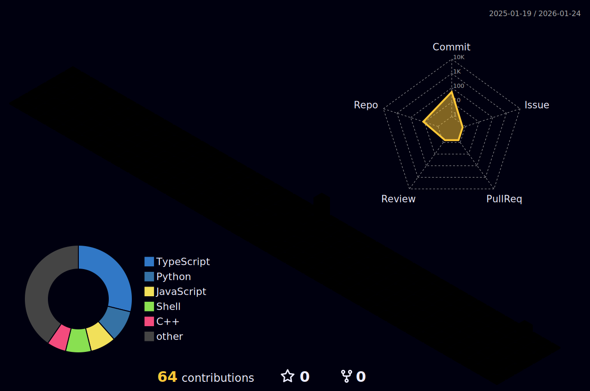

<!-- ### Hi there 👋 -->

<!--
**mpm-10/mpm-10** is a ✨ _special_ ✨ repository because its `README.md` (this file) appears on your GitHub profile.

Here are some ideas to get you started:

- 🔭 I’m currently working on ...
- 🌱 I’m currently learning ...
- 👯 I’m looking to collaborate on ...
- 🤔 I’m looking for help with ...
- 💬 Ask me about ...
- 📫 How to reach me: ...
- 😄 Pronouns: ...
- ⚡ Fun fact: ...
-->

<h1 align="center">
  
</h1>

## 👤 About Me

- 🎓 Computer science student;
- 🧑‍💻 Fullstack developer & data scientist;
- 🧪 5 years of experience in programming & development;
- 🛡️ Cyber security enthusiast;
- 🎯 Focus on personal projects & academic solutions;
- 🌱 Interest in open-source projects;
- 🧠 Always curious to explore new stacks & technologies;
- 🧩 Like to solving problems & build efficient solutions;
- 🎮 Playing games & watch animes;
- 🎵 Music is a company with coding & study;
- 🔧 Explore customization methods to productvity;
- ✨ Video editing as a hobby.

## 🌐 Contact With Me

  
  
  

## 🛠️ Programming Skills

- ### 💻 Languages

  

- ### 📄 Markups & Texts

  

- ### 🔧 Frameworks & Libraries

  

- ### 🗄️ Databases

  

- ### 🧪 Deploys & Tests

  

- ### 🚀 Prototype & Productvity

  

- ### ☁️ Cloud Platforms & Apps

  

- ### 🧠 Integrated Development Environments (IDEs)

  

- ### 🖥️ Operating Systems

  

## 📊 Activities & Stats

  

  

